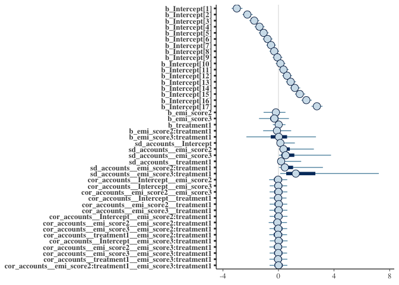
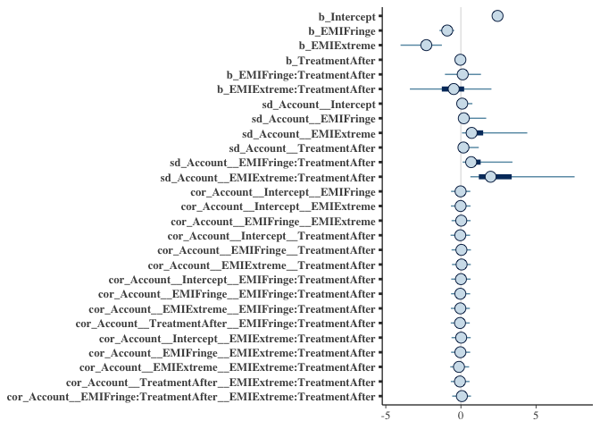

Two BRMS Models
================

# Packages

``` r
pacman::p_load(tidyverse, brms)
```

# Data

``` r
load("loglin_dat.Rdata")
loglin_dat %>% 
  glimpse
```

    ## Observations: 252
    ## Variables: 8
    ## Groups: Account, session [84]
    ## $ Account       <fct> Baseline Account, Baseline Account, Baseline Accou…
    ## $ EMI           <fct> Extreme, Extreme, Extreme, Extreme, Extreme, Extre…
    ## $ session       <dbl> 1, 2, 3, 4, 5, 6, 7, 8, 9, 10, 11, 12, 13, 14, 15,…
    ## $ Freq          <int> 1, 0, 0, 2, 0, 2, 1, 2, 0, 2, 3, 3, 4, 2, 1, 0, 0,…
    ## $ popularity    <dbl> 0.99598515, NaN, NaN, 0.98894919, NaN, 1.01443947,…
    ## $ Treatment     <fct> Before, Before, Before, Before, Before, Before, Be…
    ## $ n_per_session <int> 17, 17, 17, 17, 17, 16, 17, 18, 16, 17, 18, 18, 18…
    ## $ log_n         <dbl> 2.833213, 2.833213, 2.833213, 2.833213, 2.833213, …

``` r
load("yt_estimation.Rdata")
yt_estimation %>% 
  glimpse
```

    ## Observations: 1,443
    ## Variables: 54
    ## $ emi_score             <fct> 1, 3, 2, 1, 2, 1, 3, 1, 2, 1, 1, 1, 2, 1, …
    ## $ rank_recomm           <int> 1, 2, 3, 4, 5, 6, 7, 8, 9, 10, 11, 12, 13,…
    ## $ rank                  <dbl> 1, 2, 3, 4, 5, 6, 7, 8, 9, 10, 11, 12, 13,…
    ## $ kind                  <chr> "youtube#video", "youtube#video", "youtube…
    ## $ etag                  <chr> "\"XpPGQXPnxQJhLgs6enD_n8JR4Qk/KhEFjafSb5L…
    ## $ id                    <chr> "oFgWy2ifX5s", "jDTBsAoCFHs", "zHP-wpctKDA…
    ## $ publishedAt           <chr> "2019-01-18T13:32:11.000Z", "2018-10-19T20…
    ## $ channelId             <chr> "UCQfwfsi5VrQ8yKZ-UWmAEFg", "UCFUC7NaTxZan…
    ## $ title                 <chr> "Japan's modern-day hermits: The world of …
    ## $ description           <chr> "Subscribe to France 24 now:\nhttp://f24.m…
    ## $ channelTitle          <chr> "FRANCE 24 English", "Red Ice TV", "Mark C…
    ## $ categoryId            <chr> "25", "25", "25", "25", "25", "25", "24", …
    ## $ liveBroadcastContent  <chr> "none", "none", "none", "none", "none", "n…
    ## $ defaultAudioLanguage  <chr> "en", "en", NA, "en", NA, "en", "en", NA, …
    ## $ viewCount             <chr> "6901", "476203", "43634", "46803", "75330…
    ## $ likeCount             <chr> "183", "22235", "3773", "790", "37398", "1…
    ## $ dislikeCount          <chr> "9", "6123", "101", "24", "5353", "7", "60…
    ## $ favoriteCount         <chr> "0", "0", "0", "0", "0", "0", "0", "0", "0…
    ## $ commentCount          <chr> "141", "25764", "2408", "459", "27556", "3…
    ## $ defaultLanguage       <chr> NA, NA, NA, "en", NA, NA, NA, "en-GB", NA,…
    ## $ index_id              <chr> "oFgWy2ifX5s", "jDTBsAoCFHs", "zHP-wpctKDA…
    ## $ youtube_vid_link      <chr> "/watch?v=oFgWy2ifX5s", "/watch?v=jDTBsAoC…
    ## $ channel_name          <chr> "FRANCE 24 English", "Red Ice TV", "Mark C…
    ## $ filename              <chr> "0_2019_01_21_15_52_33_yt_best_acc1", "0_2…
    ## $ visit_time            <dttm> 2019-01-21 15:52:33, 2019-01-21 15:52:33,…
    ## $ yt_link               <chr> "https://www.youtube.com/watch?v=oFgWy2ifX…
    ## $ batch                 <dbl> 1, 1, 1, 1, 1, 1, 1, 1, 1, 1, 1, 1, 1, 1, …
    ## $ type                  <chr> "best", "best", "best", "best", "best", "b…
    ## $ is_recommended        <lgl> TRUE, TRUE, TRUE, TRUE, TRUE, TRUE, TRUE, …
    ## $ acc                   <int> 1, 1, 1, 1, 1, 1, 1, 1, 1, 1, 1, 1, 1, 1, …
    ## $ same_id               <lgl> TRUE, TRUE, TRUE, TRUE, TRUE, TRUE, TRUE, …
    ## $ kind1                 <chr> NA, NA, NA, NA, NA, NA, NA, NA, NA, NA, NA…
    ## $ etag1                 <chr> NA, NA, NA, NA, NA, NA, NA, NA, NA, NA, NA…
    ## $ publishedAt1          <chr> NA, NA, NA, NA, NA, NA, NA, NA, NA, NA, NA…
    ## $ channelId1            <chr> NA, NA, NA, NA, NA, NA, NA, NA, NA, NA, NA…
    ## $ title1                <chr> NA, NA, NA, NA, NA, NA, NA, NA, NA, NA, NA…
    ## $ description1          <chr> NA, NA, NA, NA, NA, NA, NA, NA, NA, NA, NA…
    ## $ channelTitle1         <chr> NA, NA, NA, NA, NA, NA, NA, NA, NA, NA, NA…
    ## $ categoryId1           <chr> NA, NA, NA, NA, NA, NA, NA, NA, NA, NA, NA…
    ## $ liveBroadcastContent1 <chr> NA, NA, NA, NA, NA, NA, NA, NA, NA, NA, NA…
    ## $ defaultAudioLanguage1 <chr> NA, NA, NA, NA, NA, NA, NA, NA, NA, NA, NA…
    ## $ viewCount1            <chr> NA, NA, NA, NA, NA, NA, NA, NA, NA, NA, NA…
    ## $ likeCount1            <chr> NA, NA, NA, NA, NA, NA, NA, NA, NA, NA, NA…
    ## $ dislikeCount1         <chr> NA, NA, NA, NA, NA, NA, NA, NA, NA, NA, NA…
    ## $ favoriteCount1        <chr> NA, NA, NA, NA, NA, NA, NA, NA, NA, NA, NA…
    ## $ commentCount1         <chr> NA, NA, NA, NA, NA, NA, NA, NA, NA, NA, NA…
    ## $ defaultLanguage1      <chr> NA, NA, NA, NA, NA, NA, NA, NA, NA, NA, NA…
    ## $ interaction           <dbl> 0, 0, 0, 0, 0, 0, 0, 0, 0, 0, 0, 0, 0, 0, …
    ## $ dogwhistle            <chr> NA, NA, NA, NA, NA, NA, NA, NA, NA, NA, NA…
    ## $ coded                 <dbl> 1, 1, 1, 1, 1, 1, 1, 1, 1, NA, 1, 1, 1, 1,…
    ## $ high_rank             <dbl> 1, 1, 1, 1, 1, 1, 1, 1, 1, 0, 0, 0, 0, 0, …
    ## $ accounts              <fct> extremist account, extremist account, extr…
    ## $ treatment             <fct> 0, 0, 0, 0, 0, 0, 0, 0, 0, 0, 0, 0, 0, 0, …
    ## $ rank_factor           <fct> 1, 2, 3, 4, 5, 6, 7, 8, 9, 10, 11, 12, 13,…

# Models

Both models ahve 4 chains with each 1000 draws in the warm up phase and
1000 samples for final the posterior distribution.

``` r
#table(as.numeric(yt_estimation$rank_factor) > 0)
# positivity constrait or ordered factor (?)
ord_logit <- brm(as.numeric(rank_factor) ~ emi_score*treatment + (emi_score*treatment | accounts), 
                 data = yt_estimation, family = "cumulative", cores = 4) # speed up a little bit

pois_mod <- brm(Freq ~ EMI * Treatment + (EMI * Treatment | Account), 
                data = loglin_dat, family = poisson)
```

``` r
brms::stanplot(ord_logit)
```

<!-- -->

``` r
brms::stanplot(pois_mod)
```

<!-- -->
